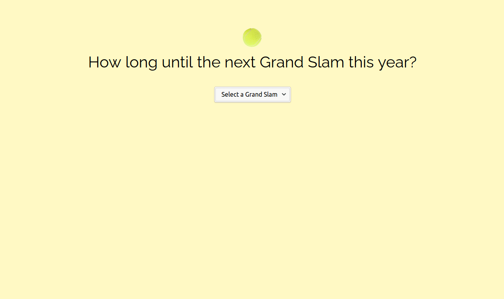

# Grand Slams
> Grand Slam 2020 tracker

## Table of contents
* [General info](#general-info)
* [Screenshots](#screenshots)
* [Technologies](#technologies)
* [Setup](#setup)
* [Features](#features)
* [Status](#status)
* [Contact](#contact)

## General info
I created this simple project so I had an example of jQuery in my personal projects. And it was a bit of excitement, giving the number of days until the next Grand Slam. I wrote this early in 2020 when there was no reason to suspect that the Grand Slams would be cancelled/change dates. Now it's just depressing and still too uncertain to update.

## Screenshots

## Technologies
* HTML
* CSS
* jQuery
* Gulp 4

## Setup
To view this project visit the [demo](https://grand-slams.netlify.com/) or download the files and open index.html

## Features
* For each grand slam tells you if the one you selected has already happened this year, is currently being played or if it's upcoming - and how many days it is away. In an alternate universe 2020.

## Status
Project is: _finished_

## Contact
Created by [nicm42](https://www.twitter.com/nicm4242) - feel free to contact me!
